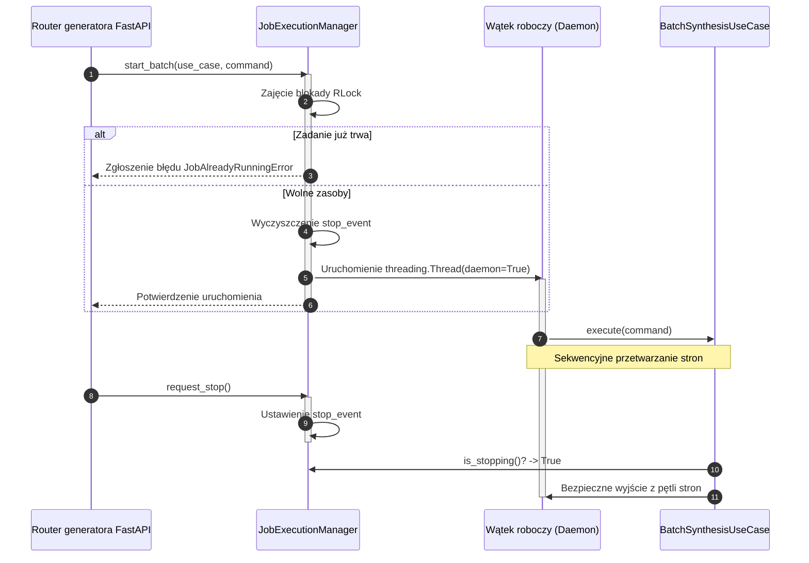

# Bezpieczeństwo wątkowe wykonywania zadań

## Przegląd

Adapter `JobExecutionManager` (`lektor.adapters.gui.jobs`) zapewnia bezpieczną wątkowo orkiestrację długotrwałych zadań syntezy wsadowej oraz konwersji wykonywanych w wątkach roboczych w tle.

---

## 1. Model współbieżności

---

## 2. Narzędzia synchronizacji

1. **Muteks wielokrotny (`threading.RLock`)**: Zabezpiecza słowniki stanu, identyfikatory aktywnie generowanych stron oraz wskaźniki wątków przed wyścigami danych podczas równoległych zapytań o stan.
2. **Sygnalizacja zatrzymania (`threading.Event`)**: Służy jako flaga kooperacyjnego przerwania pracy. Wywołanie punktu `/api/generator/stop` ustawia flagę `stop_event`, nakazując wątkowi zakończenie przetwarzania po bieżącym segmencie.
3. **Wątki typu daemon (`daemon=True`)**: Wątki robocze działają w trybie demona, co gwarantuje natychmiastowe i czyste wyłączenie procesu aplikacji bez zawieszania serwera Uvicorn.
