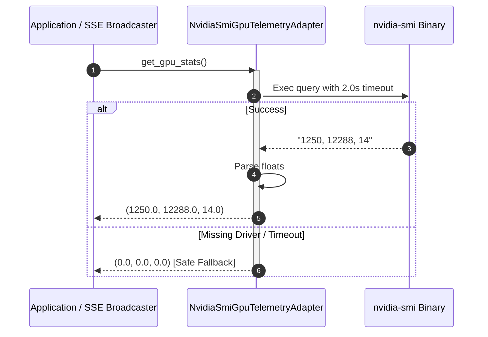

# GPU telemetry adapter specification

## Overview

The `NvidiaSmiGpuTelemetryAdapter` (`lektor.adapters.gui.gpu_adapter`) satisfies `GpuTelemetryProtocol`. It queries local graphics drivers in real time to capture memory allocation, capacity thresholds, and core utilization without native C-binding overhead.

---

## 1. Query mechanics & driver interface

The adapter executes `nvidia-smi` using non-blocking subprocess evaluation with a strict timeout:

```bash
nvidia-smi --query-gpu=memory.used,memory.total,utilization.gpu --format=csv,noheader,nounits

```



---

## 2. Invariants & error handling

* **Zero crash guarantee**: If the system runs on a headless CPU environment or `nvidia-smi` is absent from system paths, the adapter catches exceptions and safely returns `(0.0, 0.0, 0.0)`.
* **Subprocess timeout**: Queries are clamped to a $2.0\text{ s}$ timeout to prevent telemetry stalls during driver hangs.
