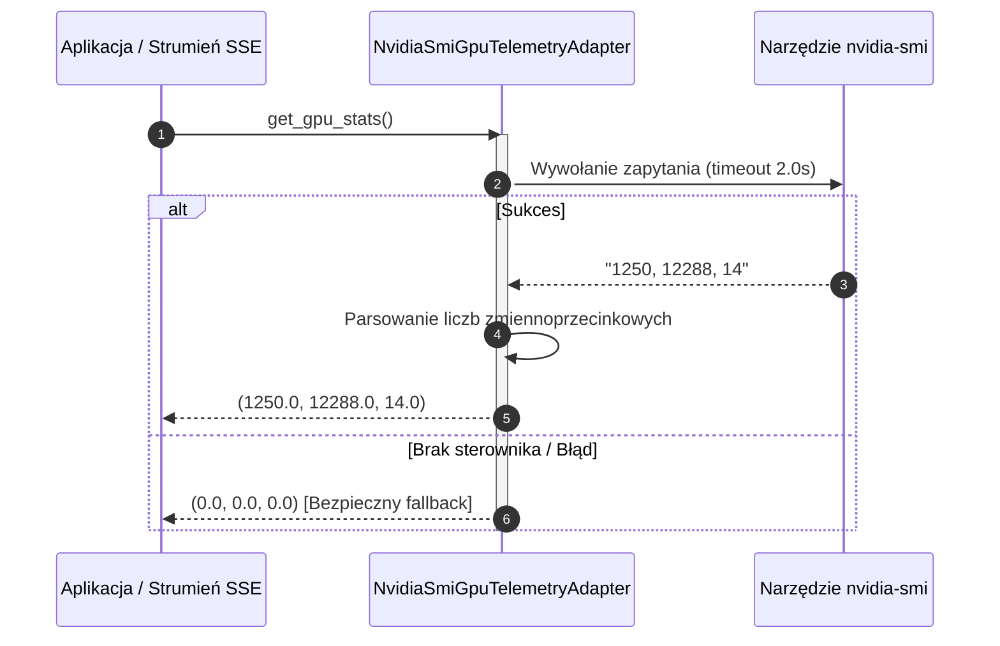

# Adapter telemetrii karty graficznej

## Przegląd

Adapter `NvidiaSmiGpuTelemetryAdapter` (`lektor.adapters.gui.gpu_adapter`) realizuje kontrakt `GpuTelemetryProtocol`. Odpytuje sterownik karty graficznej w czasie rzeczywistym o zajętość pamięci VRAM, całkowitą pojemność oraz procentowe obciążenie rdzeni CUDA bez konieczności wiązania ciężkich bibliotek C.

---

## 1. Mechanizm komunikacji ze sterownikiem

Adapter wywołuje narzędzie systemowe `nvidia-smi` w nieblokującym podprocesie z limitem czasu:

```bash
nvidia-smi --query-gpu=memory.used,memory.total,utilization.gpu --format=csv,noheader,nounits

```



---

## 2. Niezmienniki i odporność na błędy

* **Ochrona przed awarią**: Jeśli aplikacja działa w środowisku bez karty NVIDIA lub narzędzie `nvidia-smi` nie jest zainstalowane, adapter przechwytuje wyjątek i zwraca bezpieczną krotkę `(0.0, 0.0, 0.0)`.
* **Limit czasu zapytania**: Każde wywołanie sterownika ma sztywny limit czasu $2{,}0\text{ s}$, co zapobiega zawieszeniu pętli telemetrii.