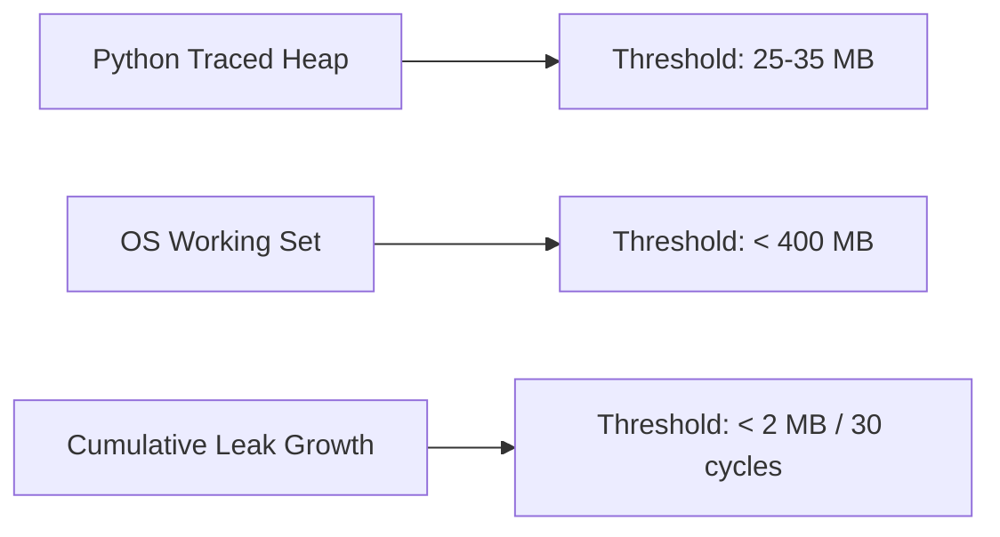

# Heap & working set memory thresholds

## Overview

This specification sets hard memory thresholds for heap allocations and operating system working set (RSS) memory. Validated through `tests/benchmark/test_benchmark_*.py`, these limits ensure Lektor Pro remains lightweight and stable under prolonged execution.

---

## 1. Standard operational thresholds



| Subsystem under test | Max allowed heap | Max allowed leak growth | Typical observed runtime |
| --- | --- | --- | --- |
| **Text normalization (50 pages)** | 25 MB | 1.0 MB | ~294 KB heap / ~3.3 s |
| **Audio stitching (20 chunks / 40s)** | 35 MB | 1.0 MB | ~9.9 MB heap / ~3.7 s |
| **Silero VAD DSP cleaning** | 20 MB | 1.0 MB | ~4.5 MB heap |
| **FastAPI status route (50 reqs)** | 25 MB | 1.0 MB | ~1.3 MB heap / ~138 ms/req |
| **Total application RSS** | 400 MB | 5.0 MB | ~320 MB RSS working set |

---

## 2. Working set measurement mechanics

On Windows, the working set is measured via the Win32 API using `ctypes` bindings to `psapi.dll`:

```python
class _PROCESS_MEMORY_COUNTERS(ctypes.Structure):
    _fields_ = [
        ("cb", wintypes.DWORD),
        ("PageFaultCount", wintypes.DWORD),
        ("PeakWorkingSetSize", ctypes.c_size_t),
        ("WorkingSetSize", ctypes.c_size_t),
        # ...
    ]

```

Querying `counters.WorkingSetSize` provides the physical RAM footprint allocated to the Python process.
