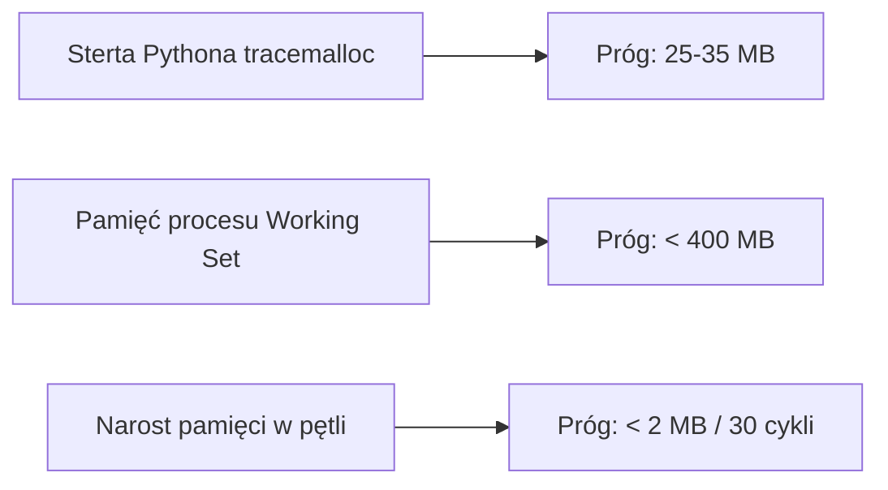

# Progi alokacji sterty i pamięci operacyjnej

## Przegląd

Dokument określa dopuszczalne normy zużycia pamięci sterty Pythona oraz fizycznej pamięci operacyjnej procesu (Working Set / RSS). Weryfikowane przez zestaw testów `tests/benchmark/test_benchmark_*.py`, progi te gwarantują stabilność aplikacji podczas wielogodzinnej pracy.

---

## 1. Zestawienie progów operacyjnych



| Badany podsystem | Maksymalna sterta | Dopuszczalny wyciek | Rzeczywisty wynik pomiaru |
| --- | --- | --- | --- |
| **Normalizacja tekstu (50 stron)** | 25 MB | 1,0 MB | ~294 KB sterta / ~3,3 s |
| **Łączenie próbek audio (20 części / 40s)** | 35 MB | 1,0 MB | ~9,9 MB sterta / ~3,7 s |
| **Czyszczenie sygnału Silero VAD** | 20 MB | 1,0 MB | ~4,5 MB sterta |
| **Obsługa zapytań HTTP FastAPI (50 req)** | 25 MB | 1,0 MB | ~1,3 MB sterta / ~138 ms/req |
| **Całkowity RAM procesu (RSS)** | 400 MB | 5,0 MB | ~320 MB Working Set |

---

## 2. Metodologia pomiaru pamięci fizycznej

W systemie Windows zużycie pamięci operacyjnej mierzone jest bezpośrednio przez bibliotekę systemową `psapi.dll` z użyciem `ctypes`:

```python
class _PROCESS_MEMORY_COUNTERS(ctypes.Structure):
    _fields_ = [
        ("cb", wintypes.DWORD),
        ("PageFaultCount", wintypes.DWORD),
        ("PeakWorkingSetSize", ctypes.c_size_t),
        ("WorkingSetSize", ctypes.c_size_t),
        # ...
    ]

```

Odczyt pola `WorkingSetSize` zwraca rzeczywistą fizyczną alokację pamięci RAM przypisaną do procesu Pythona.
