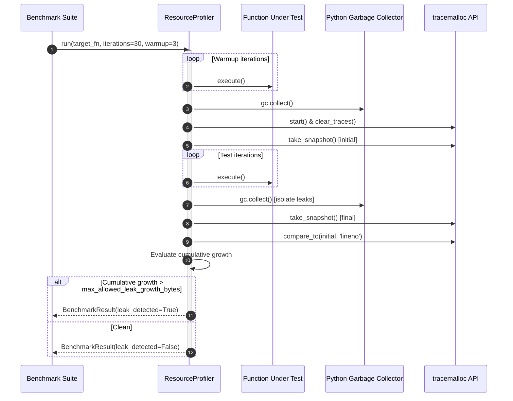

# Memory leak profiling protocol

## Overview

The `ResourceProfiler` utility (`tests.benchmark.profiler`) implements rigorous memory leak detection and profiling. It pairs standard Python `tracemalloc` snapshots with explicit garbage collection boundaries to isolate uncollected references.

---

## 1. Profiling workflow

---

## 2. Memory leak determination criteria

A test run is flagged with `leak_detected = True` if and only if:

$$\sum_{\text{stat} \in \text{diff}} \max(0, \text{stat.size\_diff}) > \text{max\_allowed\_leak\_growth\_bytes}$$

* **Warmup elimination**: Prevents initial one-time module imports and lookup table allocations from registering as false leaks.
* **Post-run garbage collection**: Guarantees that circular references collectible by `gc.collect()` do not trigger false alarms.
* **Top allocations reporting**: Captured snapshots log the top three code lines responsible for heap allocations to simplify remediation.
