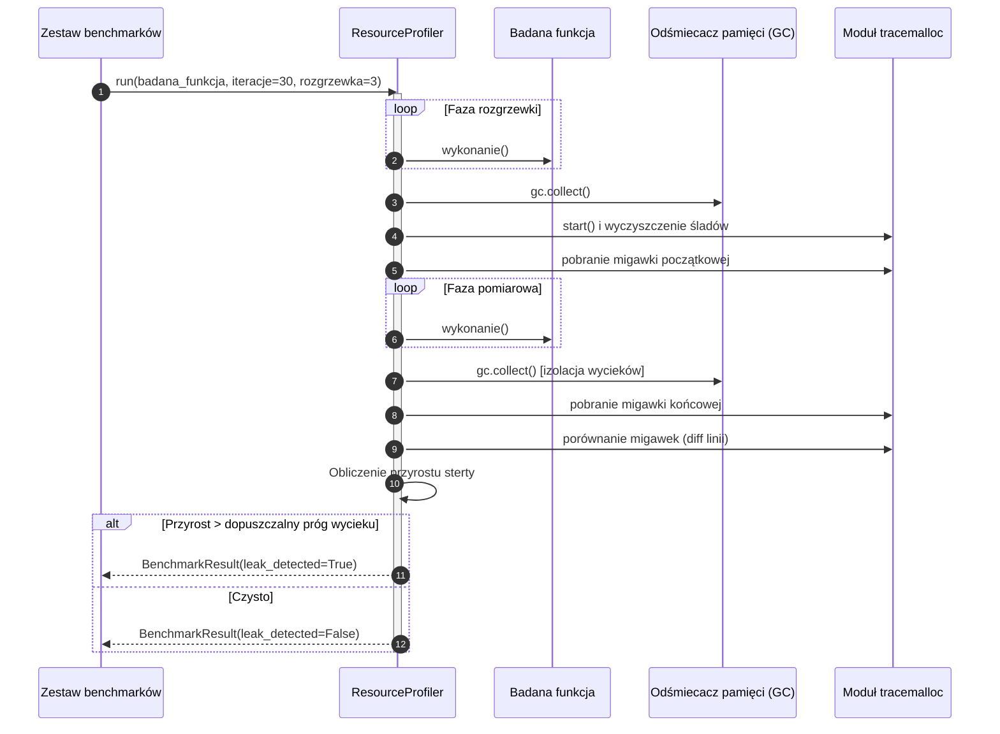

# Protokół profilowania wycieków pamięci

## Przegląd

Narzędzie `ResourceProfiler` (`tests.benchmark.profiler`) realizuje zautomatyzowane profilowanie wycieków pamięci. Łączy migawki sterty modułu `tracemalloc` z jawnym wywoływaniem odśmiecacza pamięci w celu wykrycia nieodzyskiwalnych referencji.

---

## 1. Przebieg procedury profilowania

---

## 2. Kryteria wykrywania wycieków pamięci

Zadanie benchmarkowe zostaje oznaczone flagą `leak_detected = True` wtedy i tylko wtedy, gdy:

$$\sum_{\text{stat} \in \text{diff}} \max(0, \text{stat.size\_diff}) > \text{dopuszczalny\_prog\_wycieku}$$

* **Eliminacja fazy rozgrzewki**: Zapobiega fałszywym alarmom wywołanym przez jednorazowy import modułów i buforowanie struktur.
* **Wymuszone odśmiecanie pamięci**: Wywołanie `gc.collect()` przed drugą migawką gwarantuje, że obiekty cykliczne podlegające normalnemu usunięciu nie są kwalifikowane jako wyciek.
* **Śledzenie linii kodu**: Raport wynikowy rejestruje trzy linie kodu o najwyższym przyroście alokacji, ułatwiając szybką lokalizację problemu.