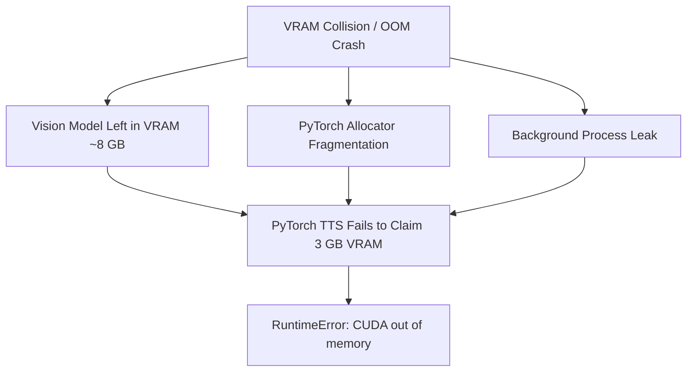

# VRAM Out-of-Memory (OOM) recovery runbook

## Overview

Executing large language models and neural speech synthesis on consumer GPUs (e.g. NVIDIA GeForce RTX 3060 12 GB) carries out-of-memory risks if both models collide in memory. This runbook establishes immediate mitigation procedures and preventive rules.

---

## 1. Root causes of VRAM collisions



1. **Preemption failure**: `SLOT_AUDIO_TTS` acquired without prior termination of `llama-server.exe`.
2. **PyTorch memory fragmentation**: PyTorch cache pools retaining unreleased blocks after speech generation.
3. **High context window allocation**: Setting context limits beyond 8,192 tokens on the vision server.

---

## 2. Emergency recovery sequence

When a `CUDA out of memory` exception occurs during operation:

### Step 1: Forcefully evict external processes

```powershell
taskkill /F /IM llama-server.exe

```

### Step 2: Trigger PyTorch cache flushing via Python shell

If the main application process is still responsive:

```python
import gc, torch
gc.collect()
if torch.cuda.is_available():
    torch.cuda.empty_cache()
    torch.cuda.ipc_collect()

```

### Step 3: Clear stale generator state files

Stale generator states prevent batch restarts. Remove the lock file:

```powershell
Remove-Item -Path "data/books/*/audio/.generator_state.json" -Force -ErrorAction SilentlyContinue

```

---

## 3. Preventive configuration checks

Verify settings in `.env` before restarting the pipeline:

* `LEKTOR_LLAMA_MODEL_PATH`: Must reference quantized weights (`Q4_K_M`), not 16-bit unquantized models.
* Context window length (`-c 8192`): Never exceed 8,192 tokens when sharing a 12 GB GPU.
* Reasoning tokens budget: Keep `--reasoning-budget 0` to prevent token generation bursts from overflowing context limits.
