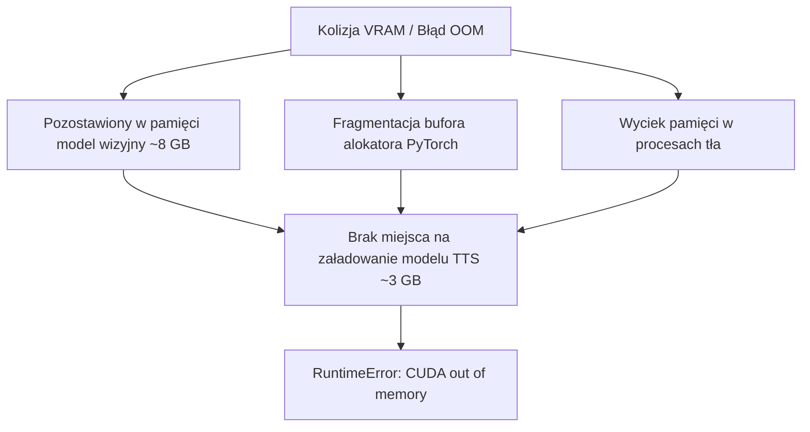

# Instrukcja postępowania przy braku pamięci VRAM (OOM)

## Przegląd

Uruchamianie modeli wizyjnych oraz neuronowej syntezy mowy na konsumenckich kartach graficznych (np. NVIDIA GeForce RTX 3060 12 GB) wiąże się z ryzykiem wyczerpania pamięci VRAM w przypadku jednoczesnej obecności obu modeli. Dokument przedstawia kroki awaryjne oraz zasady zapobiegawcze.

---

## 1. Przyczyny kolizji pamięci karty graficznej



1. **Brak wywłaszczenia**: Zajęcie slotu `SLOT_AUDIO_TTS` bez uprzedniego zamknięcia procesu `llama-server.exe`.
2. **Fragmentacja pamięci PyTorch**: Blokowanie zwolnionych tensorów w wewnętrznej puli alokatora CUDA frameworka PyTorch.
3. **Zbyt duże okno kontekstu**: Przekroczenie limitu 8 192 tokenów na serwerze wizyjnym.

---

## 2. Awaryjna procedura przywracania sprawności

Gdy w terminalu wystąpi błąd `RuntimeError: CUDA out of memory`:

### Krok 1: Zamknięcie procesu serwera modeli wizyjnych

```powershell
taskkill /F /IM llama-server.exe

```

### Krok 2: Wyczyszczenie pamięci podręcznej PyTorch

W konsoli Pythona lub skrypcie:

```python
import gc, torch
gc.collect()
if torch.cuda.is_available():
    torch.cuda.empty_cache()
    torch.cuda.ipc_collect()

```

### Krok 3: Usunięcie zablokowanych plików stanu generatora

Przedawniony plik blokady uniemożliwia ponowne uruchomienie syntezy. Należy go usunąć:

```powershell
Remove-Item -Path "data/books/*/audio/.generator_state.json" -Force -ErrorAction SilentlyContinue

```

---

## 3. Weryfikacja ustawień zapobiegawczych

Przed ponownym uruchomieniem sprawdź konfigurację w pliku `.env`:

* `LEKTOR_LLAMA_MODEL_PATH`: Musi wskazywać na skwantyzowany model (`Q4_K_M`), a nie pełne wagi 16-bitowe.
* Rozmiar kontekstu (`-c 8192`): Nie przekraczaj wartości 8 192 tokenów na karcie o pojemności 12 GB VRAM.
* Budżet rozumowania: Utrzymuj parametr `--reasoning-budget 0`, aby zapobiec nagłym skokom alokacji pamięci podczas generowania odpowiedzi.