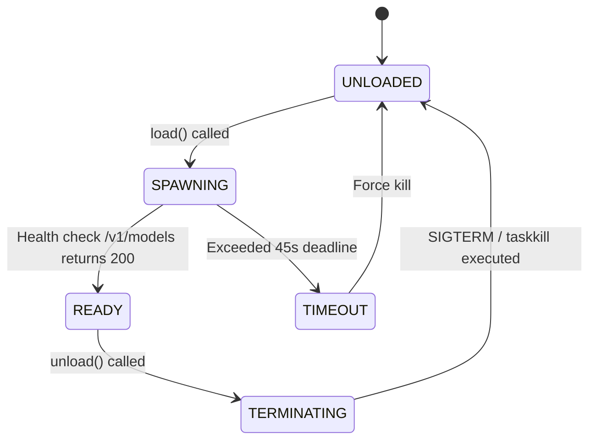

# llama-server lifecycle manager

## Overview

The `ProcessModelHandle` adapter (`lektor.adapters.resources.arbiter`) controls the lifecycle of external C++ inference processes hosting multimodal models, such as `llama-server.exe`. It manages process spawning, HTTP health checks, and process termination.

---

## 1. Process lifecycle state machine



---

## 2. Command-line invocation parameters

`ProcessModelHandle` spawns `llama-server.exe` with parameters optimized for RTX 3060 hardware:

```python
cmd = [
    str(settings.llama_server_binary),
    "-m", str(settings.llama_model_path),
    "--mmproj", str(settings.llama_mmproj_path),
    "--host", "0.0.0.0",
    "--port", str(settings.llama_server_port),
    "-ngl", "99",               # Offload all layers to GPU
    "-ub", "2048",              # Micro-batch size
    "--reasoning-budget", "0",  # Disable reasoning tokens overhead
    "--alias", "google/gemma-4-12b",
    "-c", "8192",               # Context window limit
]

```

* Executed with `subprocess.Popen` suppressing external console windows via `creationflags=CREATE_NO_WINDOW`.

---

## 3. Health check polling & shutdown sequence

1. **Polling deadline**: Following process launch, `is_loaded()` polls `http://127.0.0.1:1234/v1/models` every 500 ms until HTTP status 200 is confirmed (timeout: 45 seconds).
2. **Graceful shutdown**: Sends `terminate()` signal, waiting up to 4.0 seconds for process exit.
3. **Guaranteed kill**: If the process fails to exit within the grace period, executes `kill()` followed by `taskkill /F /IM llama-server.exe` to prevent orphaned background processes.
