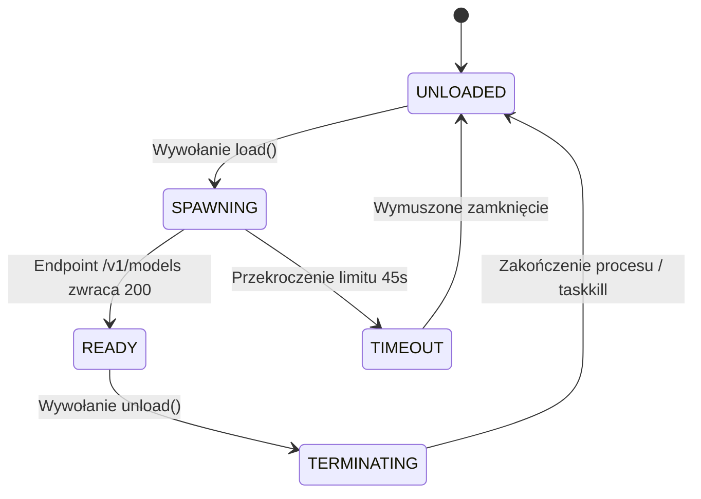

# Menedżer cyklu życia serwera llama-server

## Przegląd

Adapter `ProcessModelHandle` (`lektor.adapters.resources.arbiter`) odpowiada za nadzór nad zewnętrznym procesem inferencyjnym serwera modeli wizyjnych `llama-server.exe`. Zarządza uruchamianiem procesu, sprawdzaniem gotowości przez HTTP oraz czyszczeniem pamięci po zakończeniu pracy.

---

## 1. Maszyna stanów cyklu życia procesu



---

## 2. Parametry uruchomieniowe procesu

Klasa `ProcessModelHandle` startuje `llama-server.exe` z flagami zoptymalizowanymi pod kartę RTX 3060:

```python
cmd = [
    str(settings.llama_server_binary),
    "-m", str(settings.llama_model_path),
    "--mmproj", str(settings.llama_mmproj_path),
    "--host", "0.0.0.0",
    "--port", str(settings.llama_server_port),
    "-ngl", "99",               # Przeniesienie wszystkich warstw do VRAM
    "-ub", "2048",              # Rozmiar mikro-paczki
    "--reasoning-budget", "0",  # Wyłączenie tokenów rozumowania
    "--alias", "google/gemma-4-12b",
    "-c", "8192",               # Limit okna kontekstu
]

```

* Proces jest uruchamiany w tle przez `subprocess.Popen` z flagą `creationflags=CREATE_NO_WINDOW`, zapobiegając otwieraniu okna konsoli.

---

## 3. Weryfikacja gotowości i procedura zamykania

1. **Sprawdzanie gotowości**: Po uruchomieniu metoda `is_loaded()` odpytuje endpoint `http://127.0.0.1:1234/v1/models` co 500 ms aż do uzyskania statusu HTTP 200 (limit czasu: 45 sekund).
2. **Kooperacyjne zatrzymanie**: Wysyła sygnał `terminate()`, oczekując do 4,0 sekund na zwolnienie zasobów przez serwer.
3. **Wymuszone zabicie procesu**: Jeśli proces nie reaguje, wywoływana jest metoda `kill()` oraz polecenie systemowe `taskkill /F /IM llama-server.exe`, co gwarantuje usunięcie procesów osieroconych.
