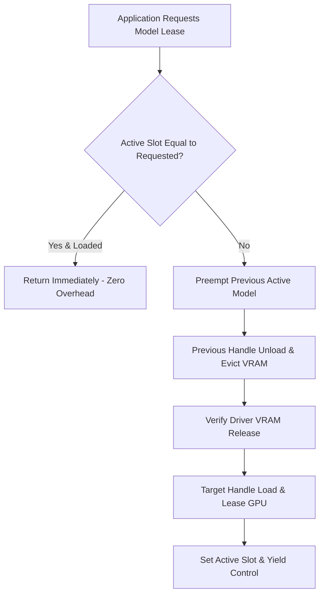

# Mutual exclusion engine (VRAM arbiter)

## Overview

The `DynamicVramModelArbiter` (`lektor.adapters.resources.arbiter`) provides dynamic mutual exclusion for AI models running on hardware with limited GPU memory. It guarantees that high-demand multimodal models (`SLOT_VISION`) and neural speech synthesis engines (`SLOT_AUDIO_TTS`) never allocate VRAM simultaneously.

---

## 1. Mutual exclusion state model



---

## 2. Preemption sequence

When `acquire(target_slot)` is invoked:

1. **Thread safety**: Locks a reentrant mutex (`threading.RLock`) to serialize concurrent acquisition requests.
2. **Current state evaluation**: If `active_slot == target_slot` and the underlying handle reports `is_loaded() == True`, acquisition returns immediately.
3. **Eviction of occupying model**:
* If switching from `SLOT_VISION` to `SLOT_AUDIO_TTS`: Terminates `llama-server.exe` and waits for process cleanup.
* If switching from `SLOT_AUDIO_TTS` to `SLOT_VISION`: Unloads PyTorch model weights and clears memory caches.


4. **Acquisition of new model**: Loads target model weights into memory.
5. **State update**: Updates `_active_slot` to the target slot identifier.

---

## 3. Context manager usage pattern

```python
with arbiter.acquire_context(SLOT_VISION):
    # Vision model guaranteed exclusive GPU access
    translated_page = vision_adapter.translate_scan(scan)
# Slot lease maintained across loop iterations until explicitly preempted

```