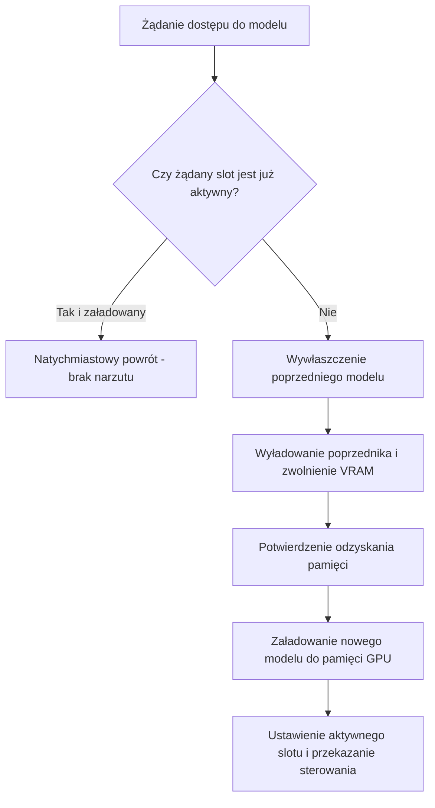

# Silnik wzajemnego wykluczania modeli (arbiter VRAM)

## Przegląd

Klasa `DynamicVramModelArbiter` (`lektor.adapters.resources.arbiter`) realizuje dynamiczne wzajemne wykluczanie modeli sztucznej inteligencji na karcie graficznej. Zapewnia, że wymagające modele wizyjne (`SLOT_VISION`) oraz neuronowe syntezatory mowy (`SLOT_AUDIO_TTS`) nigdy nie alokują pamięci VRAM w tym samym czasie.

---

## 1. Model stanów wykluczania



---

## 2. Sekwencja wywłaszczania (Preemption)

Podczas wywołania metody `acquire(docelowy_slot)`:

1. **Bezpieczeństwo wątkowe**: Blokada wielokrotna `threading.RLock` serializuje równoległe żądania dzierżawy.
2. **Sprawdzenie bieżącego stanu**: Jeśli `active_slot == docelowy_slot` i model raportuje gotowość (`is_loaded() == True`), metoda kończy działanie bez dodatkowych operacji.
3. **Zwolnienie zajmującego modelu**:
* Przełączenie z `SLOT_VISION` na `SLOT_AUDIO_TTS`: Zamyka proces `llama-server.exe` i czeka na zwolnienie pamięci.
* Przełączenie z `SLOT_AUDIO_TTS` na `SLOT_VISION`: Zrzuca wagi modeli PyTorch i czyści alokacje tensora.


4. **Załadowanie nowego modelu**: Ładuje wagi wybranego silnika do pamięci GPU.
5. **Aktualizacja rejestru**: Ustawia `_active_slot` na nowy identyfikator slotu.

---

## 3. Wykorzystanie menedżera kontekstu

```python
with arbiter.acquire_context(SLOT_VISION):
    # Model wizyjny ma zagwarantowany wyłączny dostęp do GPU
    translated_page = vision_adapter.translate_scan(scan)
# Dzierżawa slotu trwa do momentu wywłaszczenia przez inny model

```