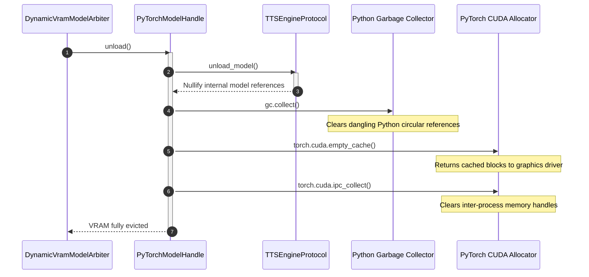

# PyTorch CUDA memory eviction

## Overview

The `PyTorchModelHandle` adapter (`lektor.adapters.resources.arbiter`) manages in-process neural models like OmniVoice and Chatterbox. It ensures PyTorch releases GPU memory back to the driver when preempted by the VRAM arbiter.

---

## 1. Memory eviction workflow

PyTorch uses an internal caching allocator to avoid CUDA allocation overhead. Releasing tensors in Python does not immediately return memory to the operating system driver without explicit eviction calls:



---

## 2. Implementation specification

```python
class PyTorchModelHandle(AIModelHandleProtocol):
    def unload(self) -> None:
        with self._lock:
            print(f"[PyTorchHandle/{self._slot_id}] Evicting model {self._resource_id}...")
            self._engine.unload_model()
            
            # Explicit three-step memory eviction
            gc.collect()
            if torch.cuda.is_available():
                torch.cuda.empty_cache()
                torch.cuda.ipc_collect()
            print(f"[PyTorchHandle/{self._slot_id}] CUDA cache cleared.")

```

---

## 3. Verification

The eviction pass is verified during automated test execution (`test_benchmark_gpu_hardware`):

* Before eviction: Used VRAM $\approx 3.2\text{ GB}$.
* After eviction: Used VRAM drops to baseline driver levels ($\le 950\text{ MB}$), providing sufficient headroom for the vision model to initialize.
