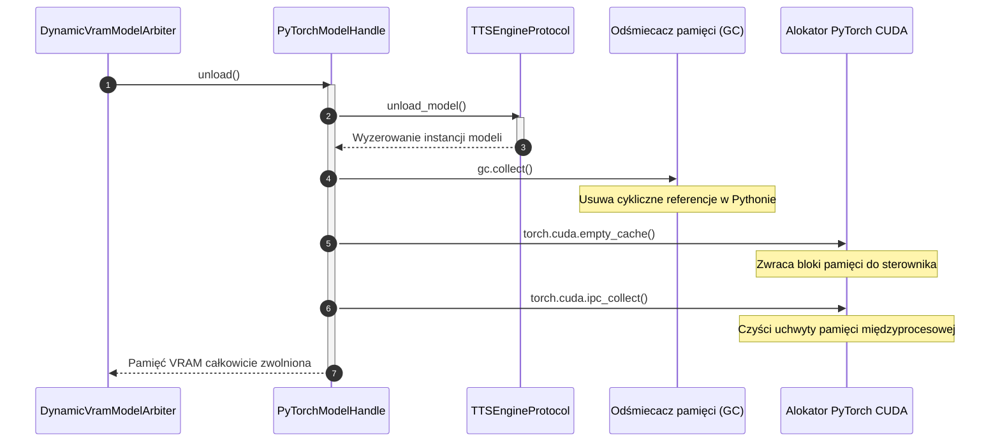

# Czyszczenie pamięci PyTorch CUDA

## Przegląd

Klasa `PyTorchModelHandle` (`lektor.adapters.resources.arbiter`) zarządza wewnątrzprocesowymi modelami neuronowymi OmniVoice oraz Chatterbox. Odpowiada za zwrócenie pamięci GPU do sterownika systemowego w momencie wywłaszczenia przez arbitra VRAM.

---

## 1. Mechanizm zwalniania pamięci

Framework PyTorch stosuje wewnętrzny alokator pamięci podręcznej (caching allocator), aby uniknąć częstych wywołań systemowych CUDA. Samo usunięcie referencji do obiektów w Pythonie nie zwraca pamięci do sterownika bez jawnego wywołania czyszczenia:



---

## 2. Implementacja w kodzie

```python
class PyTorchModelHandle(AIModelHandleProtocol):
    def unload(self) -> None:
        with self._lock:
            print(f"[PyTorchHandle/{self._slot_id}] Zwalnianie modelu {self._resource_id}...")
            self._engine.unload_model()
            
            # Trzyetapowe czyszczenie alokacji
            gc.collect()
            if torch.cuda.is_available():
                torch.cuda.empty_cache()
                torch.cuda.ipc_collect()
            print(f"[PyTorchHandle/{self._slot_id}] Pamięć podręczna CUDA wyczyszczona.")

```

---

## 3. Weryfikacja działania

Skuteczność czyszczenia pamięci jest potwierdzona testami benchmarkowymi (`test_benchmark_gpu_hardware`):

* Przed wyczyszczeniem: Zajętość VRAM $\approx 3{,}2\text{ GB}$.
* Po wyczyszczeniu: Zajętość VRAM spada do poziomu bazowego sterownika ($\le 950\text{ MB}$), co zapewnia pełną przestrzeń dla modelu wizyjnego.
