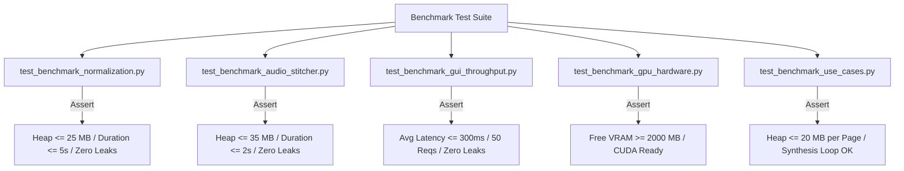

# Benchmark & memory regression testing

## Overview

The benchmark test suite (`tests/benchmark/`) verifies that Lektor Pro adheres to strict resource thresholds, preserves sub-second execution targets, and guarantees zero memory leaks under continuous load.

---

## 1. Test coverage & execution scope



---

## 2. Benchmark runners & CLI reporting

Benchmarks can be run as standard unit tests or through the dedicated standalone profiler script:

```powershell
# Run via standard unittest discovery
python -m unittest discover -s tests/benchmark

# Run interactive diagnostic benchmark runner with full tabular report
python scripts/run_benchmarks.py

```

### Typical benchmark baseline report (RTX 3060 12 GB, Python 3.14)

```text
Test name                        | Duration   | CPU %    | Peak heap    | Leaks      | Status
--------------------------------------------------------------------------------------------
Text normalization (Domain)      | 3.378s     | 88.4%    | 294.51 KB    | NONE       | OK
Audio stitching & cleaning (DSP) | 3.703s     | 87.4%    | 9.95 MB      | NONE       | OK
Web GUI throughput (50 reqs)     | 6.909s     | 86.6%    | 1.37 MB      | NONE       | OK
Hardware & VRAM diagnostics      | 0.051s     | 0.0%     | 293.41 KB    | NONE       | OK
--------------------------------------------------------------------------------------------
All benchmark passes completed successfully. Zero memory leaks detected.

```

---

## 3. Continuous integration regression policy

If an update causes heap growth across iterations to exceed `max_allowed_leak_growth_bytes` (1 to 2 MB) or peak memory to exceed subsystem boundaries, the test runner fails immediately, blocking deployment to staging or production.
