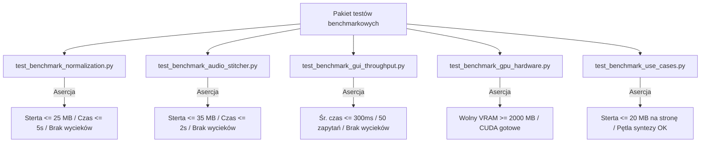

# Testy wydajnościowe i regresja pamięciowa

## Przegląd

Pakiet testów wydajnościowych (`tests/benchmark/`) weryfikuje przestrzeganie ścisłych limitów zużycia zasobów, czasy wykonywania operacji oraz brak wycieków pamięci podczas ciągłej pracy aplikacji.

---

## 1. Zakres testów benchmarkowych



---

## 2. Uruchamianie benchmarków i raportowanie

Testy wydajnościowe można uruchamiać za pomocą modułu `unittest` lub dedykowanego skryptu profilującego:

```powershell
# Uruchomienie jako standardowe testy jednostkowe
python -m unittest discover -s tests/benchmark

# Uruchomienie dedykowanego skryptu z pełnym raportem tabelarycznym
python scripts/run_benchmarks.py

```

### Wyniki referencyjne (RTX 3060 12 GB, Python 3.14)

```text
Nazwa testu                      | Czas       | CPU %    | Szczyt heap  | Wycieki    | Norma
--------------------------------------------------------------------------------------------
Normalizacja tekstu (Domena)     | 3.378s     | 88.4%    | 294.51 KB    | BRAK       | OK
Łączenie i czyszczenie audio     | 3.703s     | 87.4%    | 9.95 MB      | BRAK       | OK
Przepustowość Web GUI (50 req)   | 6.909s     | 86.6%    | 1.37 MB      | BRAK       | OK
Diagnostyka sprzętowa i VRAM     | 0.051s     | 0.0%     | 293.41 KB    | BRAK       | OK
--------------------------------------------------------------------------------------------
Wszystkie testy zakończone sukcesem. Brak wycieków pamięci.

```

---

## 3. Ochrona przed regresją w potoku CI

Jeśli zmiana w kodzie spowoduje narost sterty w pętli wielokrotnej przekraczający próg `max_allowed_leak_growth_bytes` (1 do 2 MB) lub szczyt alokacji przekroczy założoną normę, test zgłasza błąd i blokuje zatwierdzenie zmian w repozytorium.
