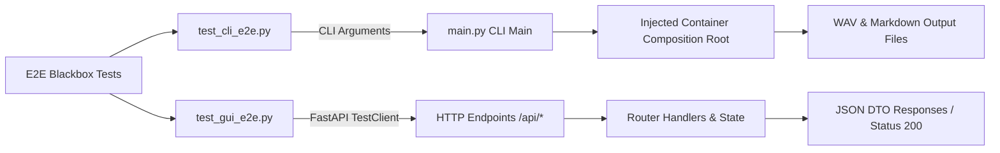

# End-to-end (E2E) blackbox workflows

## Overview

End-to-end tests (`tests/e2e/`) validate complete user journeys across real entry-point boundaries without mocking internal application layers.

---

## 1. Testing boundaries & workflows

---

## 2. CLI end-to-end suite (`test_cli_e2e.py`)

Executes command-line subcommands using in-memory string buffers (`io.StringIO`) and temporary workspaces (`tempfile.TemporaryDirectory`):

* `test_e2e_cli_preview`: Runs `preview` subcommand on source Markdown, verifying section segmentation output to stdout.
* `test_e2e_cli_single_mock_generation`: Runs `single` subcommand with `--mock` flag. Asserts that `page_042.wav` and `page_042_normalized.txt` are created on disk and exceed minimal byte thresholds.
* `test_e2e_cli_batch_mock_generation`: Runs `batch` subcommand over multi-page directories, verifying complete batch progression and zero dropped pages.
* `test_e2e_cli_books_list`: Verifies terminal formatting of the global book catalog (`books list`).

---

## 3. Web GUI end-to-end suite (`test_gui_e2e.py`)

Tests the application server via `starlette.testclient.TestClient`:

* `/api/status`: Asserts structural compliance of `BookStatusDTO`, page lists, and progress ratios.
* `/api/notes`: Verifies the full CRUD lifecycle (saving markdown content via POST and reading via GET).
* `/api/studio/history`: Verifies discovery and listing of persisted studio recordings.
* Path traversal protection: Confirms security boundaries reject traversal attempts (e.g. `/audio/..%2F..%2Frun_gui.py` returns HTTP 404).