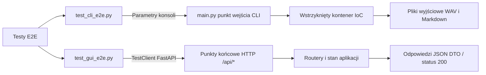

# Testy end-to-end (E2E)

## Przegląd

Testy end-to-end (`tests/e2e/`) weryfikują kompletne ścieżki użytkownika przez oficjalne punkty wejścia do aplikacji bez mockowania wewnętrznych warstw logiki biznesowej.

---

## 1. Architektura testów E2E

---

## 2. Zestaw testów konsolowych CLI (`test_cli_e2e.py`)

Uruchamia podpolecenia konsoli z przechwytywaniem standardowego wyjścia (`io.StringIO`) w katalogach tymczasowych:

* `test_e2e_cli_preview`: Wykonuje polecenie `preview` na pliku Markdown, weryfikując poprawność segmentacji tekstu na konsoli.
* `test_e2e_cli_single_mock_generation`: Wywołuje polecenie `single` z flagą `--mock`. Sprawdza obecność plików `page_042.wav` oraz `page_042_normalized.txt` i ich minimalny rozmiar.
* `test_e2e_cli_batch_mock_generation`: Uruchamia polecenie `batch` na katalogu z wieloma stronami, potwierdzając bezbłędne przetworzenie całej partii.
* `test_e2e_cli_books_list`: Sprawdza poprawne formatowanie tabeli katalogu książek (`books list`).

---

## 3. Zestaw testów serwera Web GUI (`test_gui_e2e.py`)

Testuje działanie serwera aplikacji za pomocą narzędzia `TestClient`:

* `/api/status`: Weryfikuje strukturę odpowiedzi `BookStatusDTO`, listę stron oraz wskaźniki postępu.
* `/api/notes`: Bada pełny cykl życia notatek (zapis przez POST, odczyt przez GET).
* `/api/studio/history`: Sprawdza pobieranie listy nagrań zapisanych na dysku.
* Ochrona przed atakami path traversal: Potwierdza, że próby wyjścia poza katalogi audio (np. `/audio/..%2F..%2Frun_gui.py`) są blokowane kodem HTTP 404.
