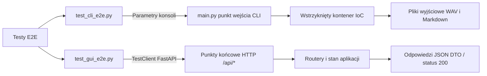
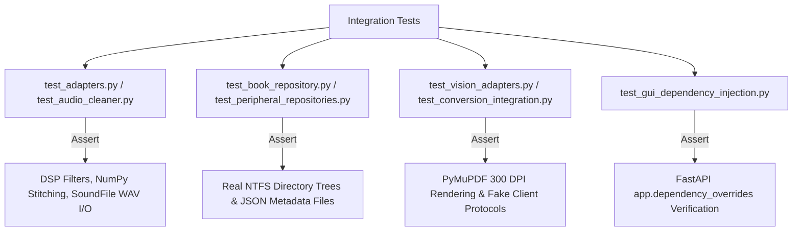
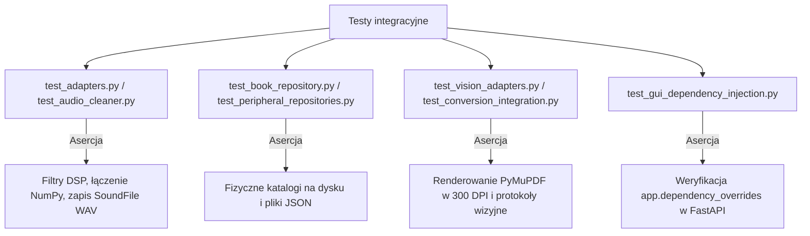

# Testy end-to-end (E2E)

## Przegląd

Testy end-to-end (`tests/e2e/`) weryfikują kompletne ścieżki użytkownika przez oficjalne punkty wejścia do aplikacji bez mockowania wewnętrznych warstw logiki biznesowej.

---

## 1. Architektura testów E2E



---

## 2. Zestaw testów konsolowych CLI (`test_cli_e2e.py`)

Uruchamia podpolecenia konsoli z przechwytywaniem standardowego wyjścia (`io.StringIO`) w katalogach tymczasowych:

* `test_e2e_cli_preview`: Wykonuje polecenie `preview` na pliku Markdown, weryfikując poprawność segmentacji tekstu na konsoli.
* `test_e2e_cli_single_mock_generation`: Wywołuje polecenie `single` z flagą `--mock`. Sprawdza obecność plików `page_042.wav` oraz `page_042_normalized.txt` i ich minimalny rozmiar.
* `test_e2e_cli_batch_mock_generation`: Uruchamia polecenie `batch` na katalogu z wieloma stronami, potwierdzając bezbłędne przetworzenie całej partii.
* `test_e2e_cli_books_list`: Sprawdza poprawne formatowanie tabeli katalogu książek (`books list`).

---

## 3. Zestaw testów serwera Web GUI (`test_gui_e2e.py`)

Testuje działanie serwera aplikacji za pomocą narzędzia `TestClient`:

* `/api/status`: Weryfikuje strukturę odpowiedzi `BookStatusDTO`, listę stron oraz wskaźniki postępu.
* `/api/notes`: Bada pełny cykl życia notatek (zapis przez POST, odczyt przez GET).
* `/api/studio/history`: Sprawdza pobieranie listy nagrań zapisanych na dysku.
* Ochrona przed atakami path traversal: Potwierdza, że próby wyjścia poza katalogi audio (np. `/audio/..%2F..%2Frun_gui.py`) są blokowane kodem HTTP 404.

```

---

### Ścieżka: `docs/06-quality-and-engineering/test-pyramid/integration-adapters.md`

```markdown
# Integration adapter testing

## Overview

Integration tests (`tests/integration/`) evaluate adapter implementations against real file systems, DSP signal processing, audio codecs, and FastAPI dependency overrides.

---

## 1. Scope & tested adapters



---

## 2. Key test suites

* **Audio DSP integration (`test_audio_cleaner.py`, `test_adapters.py`)**: Tests high-pass Butterworth filters, Silero VAD boundary truncations, fade-in/fade-out curves, and volume peak normalization using synthetic sine waves.
* **Book repository persistence (`test_book_repository.py`)**: Verifies canonical directory creation under `data/books/<slug>/`, `metadata.json` serialization, and catalog scanning.
* **PDF rendering integration (`test_conversion_integration.py`)**: Generates real in-memory 2-page PDF files with PyMuPDF, rasterizes them to 150/300 DPI JPEGs, and asserts bitmap header validity.
* **FastAPI dependency injection (`test_gui_dependency_injection.py`)**: Proves that `app.dependency_overrides` can substitute production file repositories with in-memory test fakes without modifying application routing.

```

---

### Ścieżka: `docs/06-quality-and-engineering/test-pyramid/integration-adapters.pl.md`

```markdown
# Testy integracyjne adapterów

## Przegląd

Testy integracyjne (`tests/integration/`) weryfikują implementacje adapterów w kontakcie z rzeczywistym systemem plików, filtrami DSP, kodekami dźwiękowymi oraz mechanizmem nadpisywania zależności w FastAPI.

---

## 1. Zakres badanych komponentów



---

## 2. Kluczowe zestawy testowe

* **Integracja audio DSP (`test_audio_cleaner.py`, `test_adapters.py`)**: Bada działanie filtru Butterwortha, przycinanie mowy przez Silero VAD, wygładzanie brzegów oraz normalizację amplitudy na syntetycznych falach sinusoidalnych.
* **Persystencja katalogu książek (`test_book_repository.py`)**: Sprawdza tworzenie struktury podkatalogów w `data/books/<slug>/`, zapis metadanych w `metadata.json` i skanowanie repozytorium.
* **Renderowanie stron PDF (`test_conversion_integration.py`)**: Tworzy dwustronicowy dokument PDF za pomocą PyMuPDF, renderuje go do plików JPEG w 150/300 DPI i weryfikuje nagłówki plików rastrowych.
* **Wstrzykiwanie zależności w Web GUI (`test_gui_dependency_injection.py`)**: Potwierdza możliwość pełnej podmiany repozytoriów dyskowych na atrapy pamięciowe za pomocą `app.dependency_overrides` bez modyfikacji kodu routerów.
