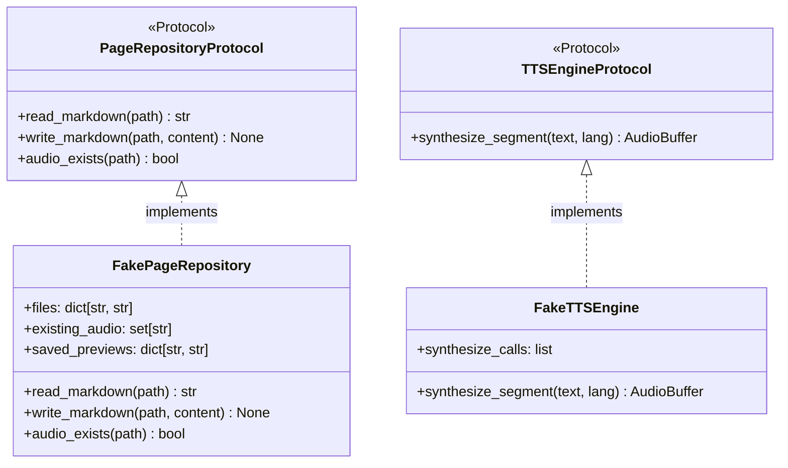

# Unit testing with application fakes

## Overview

Use case unit tests (`tests/unit/application/`) evaluate business orchestration logic in complete isolation from the filesystem, external models, and network connections. This is achieved by injecting in-memory test fakes satisfying port contracts.

---

## 1. Test doubles architecture

---

## 2. In-memory fake implementations

Defined directly within the test modules:

* **`FakePageRepository`**: Stores Markdown documents, states, and preview texts in memory dictionaries (`dict[str, str]`), providing zero filesystem I/O.
* **`FakeTTSEngine`**: Records calls and immediately returns deterministic numpy float32 arrays without GPU invocation.
* **`FakeAudioStitcher`**: Merges array lengths in memory and records export paths without encoding WAV files.
* **`FakePdfSplitter`**: Generates mock `DocumentScan` tuples referencing simulated paths without spawning PyMuPDF rendering pipelines.
* **`FakeVisionTranslator`**: Immediately returns structured `TranslatedMarkdownPage` objects containing test text and Mermaid blocks.

---

## 3. Verified test scenarios

* **Skip existing execution**: Confirms `SynthesizePageUseCase` bypasses synthesis and returns immediately when `audio_exists()` reports true.
* **Single-page failure resilience**: Confirms `ConvertPdfBookUseCase` catches exceptions on page $K$, logs the error to `failed_pages`, and completes the remaining pages (`BR-013`).
* **Cooperative cancellation**: Confirms `BatchSynthesisUseCase` cleanly breaks out of loops when `check_cancellation()` signals true.
