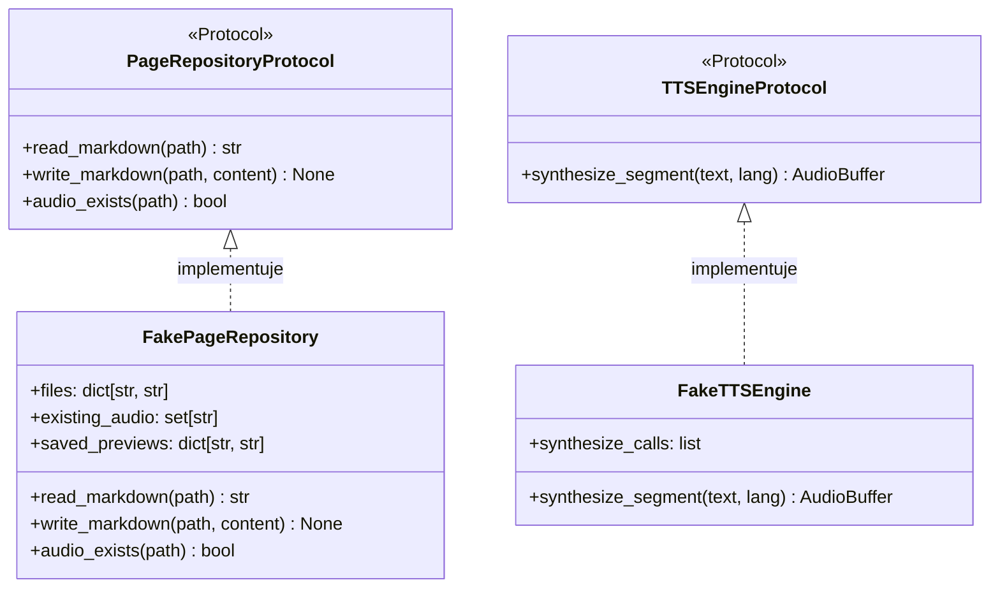

# Testy jednostkowe z atrapami aplikacyjnymi (fakes)

## Przegląd

Testy jednostkowe warstwy aplikacji (`tests/unit/application/`) weryfikują orkiestrację logiki biznesowej w całkowitym odcięciu od systemu plików, zewnętrznych modeli AI oraz sieci. Wykorzystują w tym celu atrapy pamięciowe (ang. *in-memory fakes*) implementujące protokoły portów.

---

## 1. Architektura atrap testowych

---

## 2. Implementacje atrap pamięciowych

Zdefiniowane bezpośrednio w modułach testowych:

* **`FakePageRepository`**: Przechowuje dokumenty Markdown, pliki stanu oraz podglądy w słownikach w pamięci RAM (`dict[str, str]`), eliminując operacje dyskowe.
* **`FakeTTSEngine`**: Rejestruje wywołania i natychmiast zwraca deterministyczne tablice próbek float32 bez użycia GPU.
* **`FakeAudioStitcher`**: Łączy długości buforów w pamięci i rejestruje ścieżki zapisu bez kodowania plików WAV.
* **`FakePdfSplitter`**: Zwraca kolekcję obiektów `DocumentScan` bez uruchamiania renderera PyMuPDF.
* **`FakeVisionTranslator`**: Natychmiast zwraca obiekty `TranslatedMarkdownPage` z przygotowanym tekstem i diagramami Mermaid.

---

## 3. Badane scenariusze testowe

* **Pomijanie istniejących plików**: Weryfikuje, czy `SynthesizePageUseCase` natychmiast kończy pracę, gdy metoda `audio_exists()` zwraca prawdę.
* **Odporność na błędy stron**: Potwierdza, że `ConvertPdfBookUseCase` rejestruje błąd na stronie $K$ w słowniku `failed_pages` i bez przeszkód przetwarza pozostałe strony (`BR-013`).
* **Kooperacyjne zatrzymanie**: Sprawdza, czy `BatchSynthesisUseCase` bezpiecznie przerywa pętlę po odebraniu sygnału z `check_cancellation()`.
