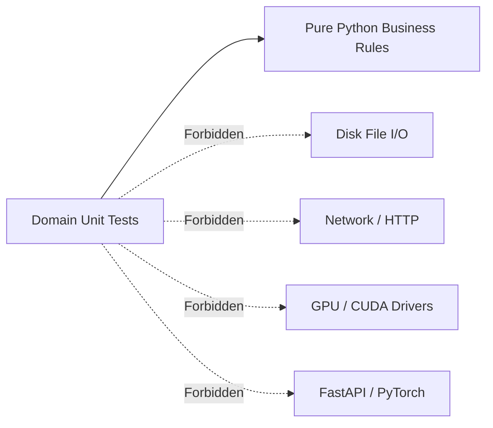

# Domain unit testing & zero-I/O isolation

## Overview

Domain unit tests (`tests/unit/domain/`) validate business rules, linguistic normalizers, value objects, and markdown validators in 100% isolation. Following clean architecture principles, this suite executes with zero disk I/O, zero network dependencies, and zero mocking frameworks.

---

## 1. Domain test isolation principle

Domain tests execute within milliseconds because they exercise pure algorithms:

* Execution speed: 28 tests in $\approx 0.047\text{ seconds}$.
* Deterministic assertions: Verify pure mathematical, string, and state transitions.

---

## 2. Tested domain components

### Entity and value object invariants (`test_domain_models.py`, `test_conversion_models.py`)

* Tests `SpeechSegment` immutability (`frozen=True`) and negative pause sanitization.
* Verifies `PageNumber` rejects non-positive integers ($< 1$).
* Verifies `BookSlug` regex validation strictly accepts `[a-z0-9_]` and rejects spaces, uppercase letters, and hyphens.
* Asserts finite state machine transitions in `ConversionJob`.

### Linguistic normalization service (`test_normalization_service.py`)

* Verifies Go code verbalization transforms operators (`:=`, `<-`, `*`, `&`) into Polish technical prose.
* Confirms numbers and ordinals are grammatically declined into words.
* Asserts that footnotes, YAML frontmatter, and trailing ellipses are stripped out cleanly.
* Tests custom code explainer strategy injection conforming to the open-closed principle.

### Markdown validation service (`test_conversion_models.py`)

* Asserts that unclosed code fences or broken node brackets in Mermaid diagrams are detected and flagged.
