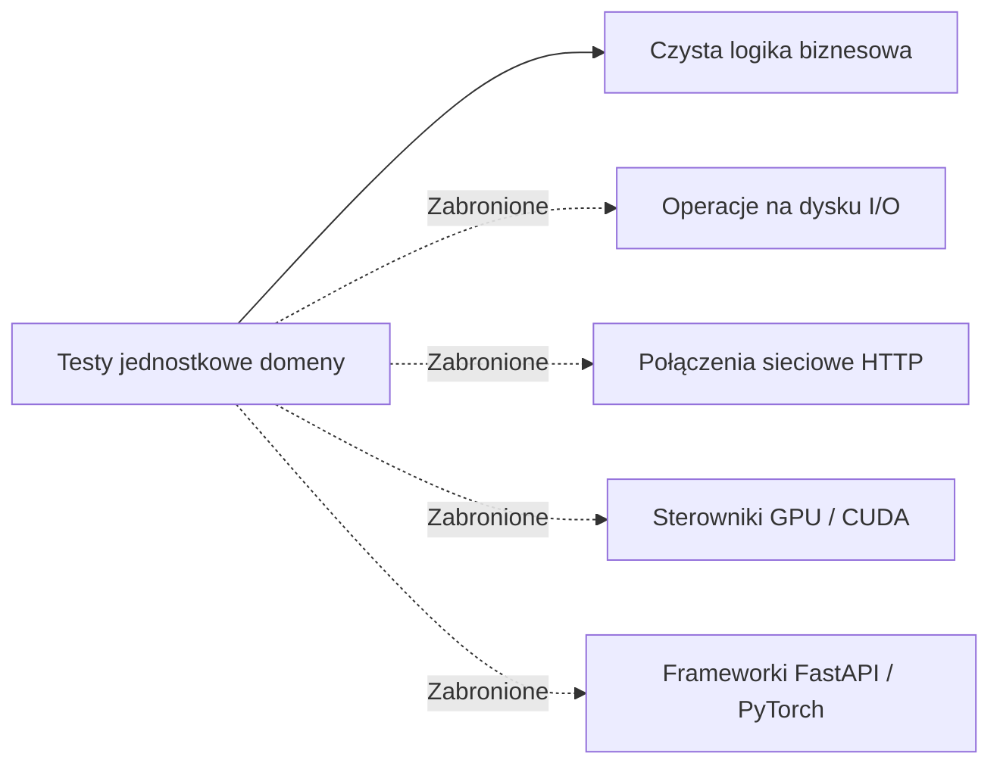

# Izolacja testów jednostkowych domeny (zero-I/O)

## Przegląd

Testy jednostkowe warstwy domeny (`tests/unit/domain/`) sprawdzają reguły biznesowe, normalizatory lingwistyczne, obiekty wartości oraz walidatory w całkowitej izolacji. Zgodnie z zasadami czystej architektury zestaw ten wykonuje się bez operacji dyskowych, bez połączeń sieciowych i bez użycia mocków.

---

## 1. Zasada izolacji testów domeny

Testy domeny wykonują się w ułamku sekundy, ponieważ sprawdzają czyste algorytmy:

* Czas wykonania: 28 testów w czasie $\approx 0{,}047\text{ sekundy}$.
* Determinizm asercji: Badanie czystych przekształceń matematycznych, operacji na łańcuchach znaków i maszynach stanów.

---

## 2. Badane komponenty domenowe

### Niezmienniki encji i obiektów wartości (`test_domain_models.py`, `test_conversion_models.py`)

* Bada niezmienność `SpeechSegment` (`frozen=True`) oraz korektę ujemnych pauz oddechowych.
* Sprawdza, czy fabryka `PageNumber` odrzuca liczby mniejsze od 1.
* Potwierdza, że walidacja `BookSlug` dopuszcza wyłącznie znaki `[a-z0-9_]`, odrzucając spacje, wielkie litery i myślniki.
* Weryfikuje poprawne przejścia stanów w maszynie stanów `ConversionJob`.

### Usługa normalizacji tekstu (`test_normalization_service.py`)

* Sprawdza, czy składnia Go zamienia operatory (`:=`, `<-`, `*`, `&`) na poprawny opis fonetyczny.
* Potwierdza poprawną odmianę gramatyczną liczb, dat i liczebników porządkowych.
* Weryfikuje bezbłędne usuwanie przypisów dolnych, nagłówków YAML i wielokropków.
* Bada wstrzykiwanie własnych strategii objaśniania kodu zgodnie z zasadą otwarte-zamknięte (OCP).

### Walidator integralności Markdownu (`test_conversion_models.py`)

* Sprawdza wykrywanie niesparowanych znaczników bloków kodu oraz niedomkniętych nawiasów w diagramach Mermaid.
