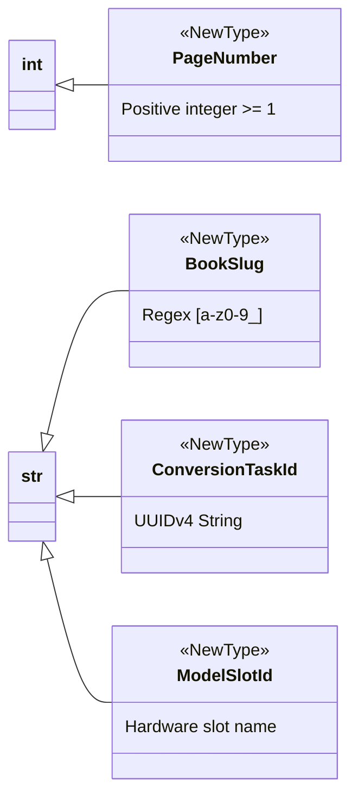

# Strong identifiers with NewType

## Overview

To eliminate primitive obsession and prevent argument confusion, Lektor Pro uses `typing.NewType` to define distinct domain identifier types.

---

## 1. Domain identifiers catalog



---

## 2. Definitions & domain factories

### `PageNumber`

```python
PageNumber = NewType("PageNumber", int)

def create_page_number(value: int) -> PageNumber:
    if value < 1:
        raise ValueError(f"Page number must be >= 1, received: {value}")
    return PageNumber(value)

```

### `BookSlug`

```python
BookSlug = NewType("BookSlug", str)

def validate_book_slug(value: str) -> BookSlug:
    clean = value.strip().lower()
    if not re.match(r"^[a-z0-9_]+$", clean):
        raise ValueError(f"Invalid slug '{value}'. Only [a-z0-9_] permitted.")
    return BookSlug(clean)

```

### `ConversionTaskId` & `ModelSlotId`

```python
ConversionTaskId = NewType("ConversionTaskId", str)
ModelSlotId = NewType("ModelSlotId", str)

SLOT_VISION = ModelSlotId("vision_ocr")
SLOT_AUDIO_TTS = ModelSlotId("audio_tts")

```

---

## 3. Static type safety benefits

Using `NewType` prevents accidental parameter transposition:

```python
def process_book_page(slug: BookSlug, page: PageNumber) -> None:
    ...

# Static type error caught by mypy before runtime:
page_idx: int = 5
raw_name: str = "cloud_go"
process_book_page(page_idx, raw_name)  # Argument type mismatch!

```