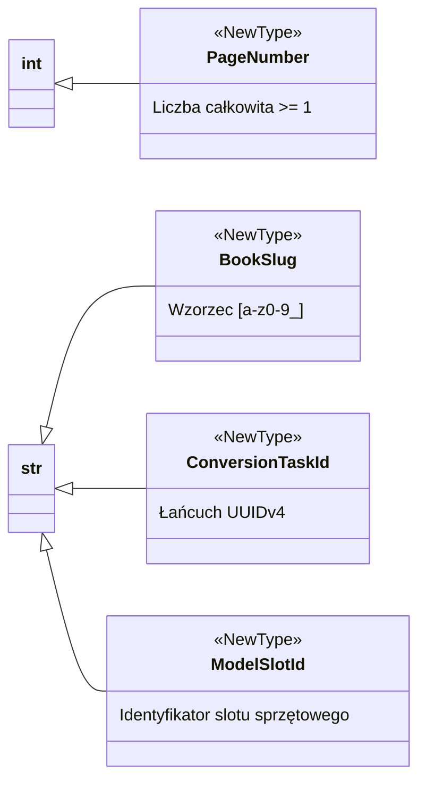

# Silne typy identyfikatorów (NewType)

## Przegląd

W celu uniknięcia antywzorca nadużywania typów prostych (ang. *primitive obsession*) oraz zapobiegania pomyłkom w kolejności argumentów, projekt Lektor Pro stosuje konstrukcję `typing.NewType` do tworzenia odrębnych typów identyfikatorów domenowych.

---

## 1. Katalog identyfikatorów domenowych



---

## 2. Definicje i fabryki domenowe

### `PageNumber`

```python
PageNumber = NewType("PageNumber", int)

def create_page_number(value: int) -> PageNumber:
    if value < 1:
        raise ValueError(f"Numer strony musi być >= 1, otrzymano: {value}")
    return PageNumber(value)

```

### `BookSlug`

```python
BookSlug = NewType("BookSlug", str)

def validate_book_slug(value: str) -> BookSlug:
    clean = value.strip().lower()
    if not re.match(r"^[a-z0-9_]+$", clean):
        raise ValueError(f"Niepoprawny slug '{value}'. Dozwolone są wyłącznie [a-z0-9_].")
    return BookSlug(clean)

```

### `ConversionTaskId` oraz `ModelSlotId`

```python
ConversionTaskId = NewType("ConversionTaskId", str)
ModelSlotId = NewType("ModelSlotId", str)

SLOT_VISION = ModelSlotId("vision_ocr")
SLOT_AUDIO_TTS = ModelSlotId("audio_tts")

```

---

## 3. Korzyści z bezpieczeństwa typów

Zastosowanie `NewType` uniemożliwia przypadkową zamianę kolejności parametrów o tym samym typie bazowym:

```python
def process_book_page(slug: BookSlug, page: PageNumber) -> None:
    ...

# Błąd wykrywany statycznie przez mypy przed uruchomieniem:
page_idx: int = 5
raw_name: str = "cloud_go"
process_book_page(page_idx, raw_name)  # Błąd niezgodności typów argumentów!

```