# Lektor Pro — Technical documentation

## Overview

**Lektor Pro** is a high-performance local platform designed to automate the conversion of technical books (PDF files and high-resolution scans) into structured Markdown documents and studio-quality synthesized audiobooks. 

Built in Python 3.14 conforming strictly to **clean architecture** principles, the platform eliminates dependencies on cloud services, running state-of-the-art multimodal vision-language models (e.g. Google Gemma 4 12B) and neural speech synthesis engines (k2-fsa OmniVoice, Resemble AI Chatterbox) entirely on local workstation hardware.

```mermaid
flowchart LR
    PDF[Technical Book PDF / Scans] --> Vision[Multimodal Vision AI Gemma 4]
    Vision --> MD[Validated Polish Markdown + Go Code]
    MD --> Norm[Linguistic & Code Normalization]
    Norm --> TTS[Neural Voice Synthesis OmniVoice]
    TTS --> DSP[Silero VAD & DSP Filtering]
    DSP --> Audio[PCM 16-bit WAV Audiobook]
    Audio --> Web[Web GUI Player & Studio Workspace]

```

---

## Key engineering pillars

1. **Clean architecture & zero-Any policy**: Total segregation of domain rules from frameworks and I/O drivers. The codebase enforces strict static typing with `mypy` and eliminates dynamic fallback types.
2. **Dynamic VRAM arbiter**: Hardware mutual exclusion mechanism enabling concurrent hosting of vision-language models (~8 GB VRAM) and neural text-to-speech engines (~3 GB VRAM) on memory-constrained consumer GPUs (e.g. 12 GB NVIDIA GeForce RTX 3060).
3. **Deterministic audio caching**: Two-tier content-addressable storage index hashing normalized text and acoustic parameters with SHA-256 to deliver instant $0\text{ ms}$ retrieval.
4. **Professional DSP pipeline**: Four-stage digital audio signal conditioning incorporating 4th-order Butterworth filtering, deep Silero voice activity detection, spectral gating, and raised-cosine edge fades.
5. **Native Vanilla ECMAScript workspace**: High-performance browser environment featuring window management, audio playback scrubbing, timeline bookmarks, and live Server-Sent Events (SSE) telemetry without external framework bloat.
6. **Bilingual GUI localization**: The interface supports Polish and English through the shared `i18n.js` module, JSON catalogs, and a `🇵🇱 PL` / `🇬🇧 EN` dropdown on the right side of the top navigation.
7. **Multilingual translation engine**: Native capability to render and translate technical pages into 140+ target languages while preserving code syntax and converting diagrams into `mermaid` blocks.

---

## Documentation structure

This technical documentation is organized into six functional modules:

* **[01. System architecture](https://www.google.com/search?q=01-architecture/c4-model/01-system-context.md)**: C4 model visual diagrams (Context, Container, Component, Deployment), clean architecture layer boundaries, and architecture decision records (ADR).
* **[02. Domain core & business rules](https://www.google.com/search?q=02-domain-core/business-rules/br-001-to-005-catalog-and-slugs.md)**: Catalog invariants (BR-001 to BR-020), entities, speech value objects, and Go grammar verbalization specifications.
* **[03. Application workflows](https://www.google.com/search?q=03-application-workflows/use-cases/uc-speech-synthesis-page-and-batch.md)**: Core use case interactors, port protocols inventory, and live event telemetry specifications.
* **[04. Adapters & interfaces](https://www.google.com/search?q=04-adapters-and-interfaces/web-gui/fast-api-routing-and-dtos.md)**: FastAPI REST endpoints, Vanilla JS window managers, GUI localization, PyMuPDF renderers, universal TTS drivers, and filesystem storage repositories. See [interface localization](04-adapters-and-interfaces/web-gui/interface-localization.md) for details.
* **[05. Operations & infrastructure](https://www.google.com/search?q=05-operations-and-infrastructure/vram-arbiter-runtime/mutual-exclusion-engine.md)**: GPU memory arbitration, model specifications, memory profilers, and troubleshooting runbooks.
* **[06. Quality & engineering standards](https://www.google.com/search?q=06-quality-and-engineering/type-system/zero-any-policy.md)**: Static type safety enforcement, test pyramid guidelines, and automated regression testing.
