# Lektor Pro — Dokumentacja techniczna

## Przegląd

**Lektor Pro** to lokalna platforma inżynieryjna stworzona do automatyzacji procesu konwersji technicznych książek informatycznych (plików PDF oraz skanów) na ustrukturyzowane dokumenty Markdown oraz profesjonalne audiobooki lektorskie.

Aplikacja została zaprojektowana w Pythonie 3.14 w oparciu o zasady **czystej architektury** (ang. *clean architecture*). Działa w pełni lokalnie bez konieczności korzystania z zewnętrznych usług chmurowych, uruchamiając zaawansowane modele wizyjne (np. Google Gemma 4 12B) oraz neuronowe syntezatory mowy (k2-fsa OmniVoice, Resemble AI Chatterbox) bezpośrednio na stacji roboczej inżyniera.

```mermaid
flowchart LR
    PDF[Plik PDF / skany książki] --> Vision[Model wizyjny AI Gemma 4]
    Vision --> MD[Przetłumaczony Markdown + kod Go]
    MD --> Norm[Normalizacja tekstu i fonetyka]
    Norm --> TTS[Neuronowa synteza mowy OmniVoice]
    TTS --> DSP[Silero VAD i filtry cyfrowe DSP]
    DSP --> Audio[Audiobook w formacie WAV PCM 16-bit]
    Audio --> Web[Odtwarzacz i studio w przeglądarce]

```

---

## Główne filary inżynieryjne

1. **Czysta architektura i polityka braku typu Any**: Całkowita izolacja reguł domenowych od bibliotek wejścia/wyjścia i frameworków. Kod podlega ścisłej kontroli statycznej w `mypy` bez używania dynamicznego typu `Any`.
2. **Dynamiczny arbiter pamięci VRAM**: Mechanizm wzajemnego wykluczania modeli, umożliwiający bezawaryjną pracę modeli wizyjnych (~8 GB VRAM) i syntezatorów mowy (~3 GB VRAM) na pojedynczej konsumenckiej karcie graficznej (np. NVIDIA GeForce RTX 3060 12 GB).
3. **Deterministyczna pamięć podręczna audio**: Dwupoziomowy magazyn segmentów mowy adresowany skrótem SHA-256 z parametrów syntezy i znormalizowanego tekstu, gwarantujący natychmiastowy odczyt w czasie $0\text{ ms}$.
4. **Czteroetapowy potok audio DSP**: Cyfrowe przetwarzanie sygnału łączące filtr górnoprzepustowy Butterwortha 4. rzędu, model Silero VAD, redukcję szumów oraz cosinusowe wygładzanie brzegów buforów.
5. **Natywny pulpit roboczy w przeglądarce**: Wydajny interfejs użytkownika napisany w czystym standardzie ECMAScript (moduły ES) z obsługą przesuwania okien, precyzyjnego przewijania nagrań i telemetrii Server-Sent Events (SSE) bez narzutu frameworków SPA.
6. **Dwujęzyczna lokalizacja GUI**: Interfejs obsługuje języki polski i angielski przez wspólny mechanizm `i18n.js`, katalogi JSON oraz listę `🇵🇱 PL` / `🇬🇧 EN` w prawej części górnej nawigacji.
7. **Pełna wielojęzyczność (140+ języków)**: Dynamiczne generowanie promptów i translacja skanów technicznych na dowolny wybrany język docelowy z zachowaniem nienaruszonej składni kodu źródłowego i automatyczną konwersją schematów na blok `mermaid`.

---

## Struktura dokumentacji

Dokumentacja techniczna została podzielona na sześć obszarów tematycznych:

* **[01. Architektura systemu](https://www.google.com/search?q=01-architecture/c4-model/01-system-context.pl.md)**: Diagramy modelu C4 (kontekst, kontenery, komponenty, wdrożenie), granice warstw oraz rejestr decyzji architektonicznych (ADR).
* **[02. Rdzeń domeny i reguły biznesowe](https://www.google.com/search?q=02-domain-core/business-rules/br-001-to-005-catalog-and-slugs.pl.md)**: Niezmienniki katalogu (BR-001 do BR-020), encje, obiekty wartości oraz specyfikacja fonetyzacji składni Go.
* **[03. Przepływy aplikacyjne](https://www.google.com/search?q=03-application-workflows/use-cases/uc-speech-synthesis-page-and-batch.pl.md)**: Interaktory przypadków użycia, wykaz portów i protokołów oraz formaty strumieniowania telemetrii.
* **[04. Adaptery i integracje](https://www.google.com/search?q=04-adapters-and-interfaces/web-gui/fast-api-routing-and-dtos.pl.md)**: Routery FastAPI, menedżer okien w JavaScripcie, lokalizacja GUI, renderer PyMuPDF, silnik TTS i repozytoria dyskowe. Szczegóły: [lokalizacja interfejsu](04-adapters-and-interfaces/web-gui/interface-localization.pl.md).
* **[05. Operacje i infrastruktura](https://www.google.com/search?q=05-operations-and-infrastructure/vram-arbiter-runtime/mutual-exclusion-engine.pl.md)**: Arbitraż zasobów karty graficznej, katalog modeli AI, progi pamięciowe oraz instrukcje usuwania awarii.
* **[06. Inżynieria i jakość kodu](https://www.google.com/search?q=06-quality-and-engineering/type-system/zero-any-policy.pl.md)**: Zasady ścisłego typowania, piramida testów oraz testy wydajnościowe chroniące przed regresją.
